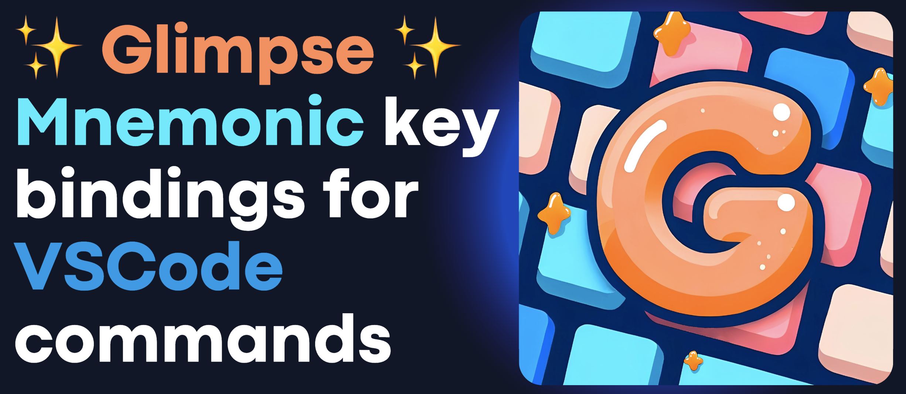

Still experimental. Not ready for use.
Come back later. 👀

## Features

- you can use the arrow keys to navigate the menu

TODO: Describe specific features of your extension including screenshots of your extension in action.

> Tip: Many popular extensions utilize animations. This is an excellent way to show off your extension! We recommend short, focused animations that are easy to follow.

## Extension Settings

Include if your extension adds any VS Code settings through the `contributes.configuration` extension point.

For example:

This extension contributes the following settings:

* `myExtension.enable`: Enable/disable this extension.
* `myExtension.thing`: Set to `blah` to do something.

## Plan

- configuration in javascript/typescript. I.e. you import our library with our key bindings and you can edit them in plain javascript. Not in json.

## Credits

  
Codebase

Parts of the codebase are inspired by:
- [VSpaceCode](https://github.com/VSpaceCode/VSpaceCode)
- [vscode-which-key](https://github.com/VSpaceCode/vscode-which-key)

  
Logo

The logo was generated using [Bing image creator](https://www.bing.com/create). Prompt:

> orange G letter in the middle of blue and salmon keyboard keys. cute. Comfy. Speedy. Cartoonish. Glamorous. logo. contains shiny stars.

[Ambra Lucia Colombo](https://www.linkedin.com/in/ambralcolombo/) edited the image to correct AI defects.

