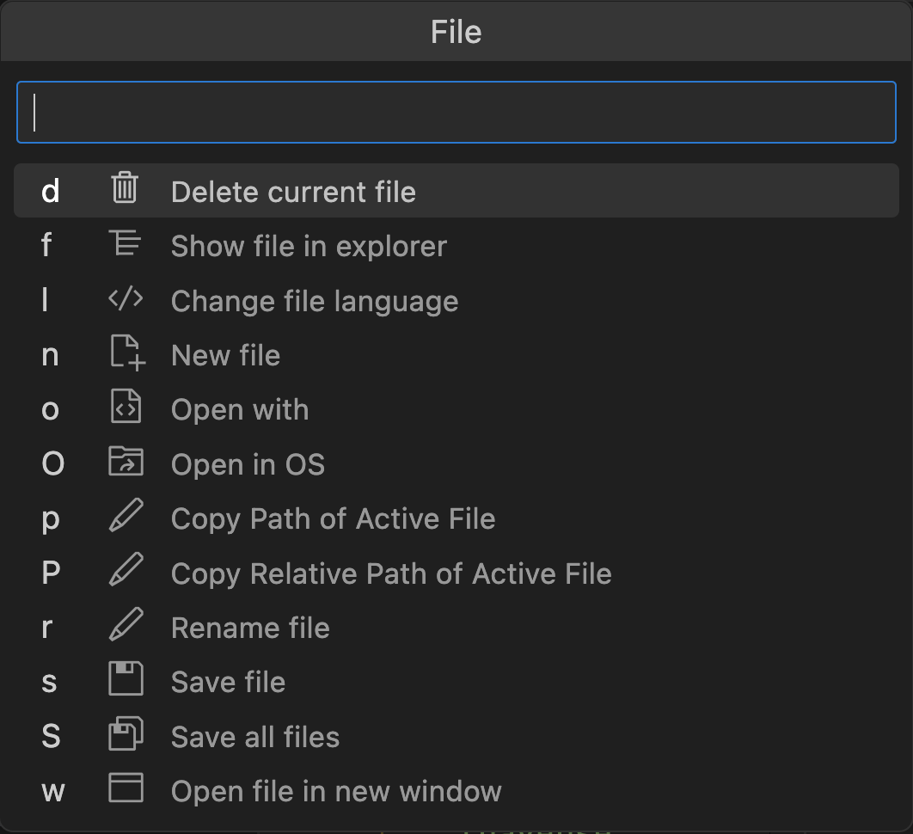

# Introduction

Glimpse is a VSCode extension that allows you to run VSCode commands with easy-to-remember key bindings.

You no longer need to remember complex shortcuts — Glimpse shows the available key bindings as you type.
E.g. when pressing `f`, Glimpse shows you all the key bindings related to files.

For example, you can press `f d` to delete the current file, or `f n` to create a new one.

If you don't want to type the letter, you can use the up and down arrow keys to navigate the menu,
and press enter to run the command.
