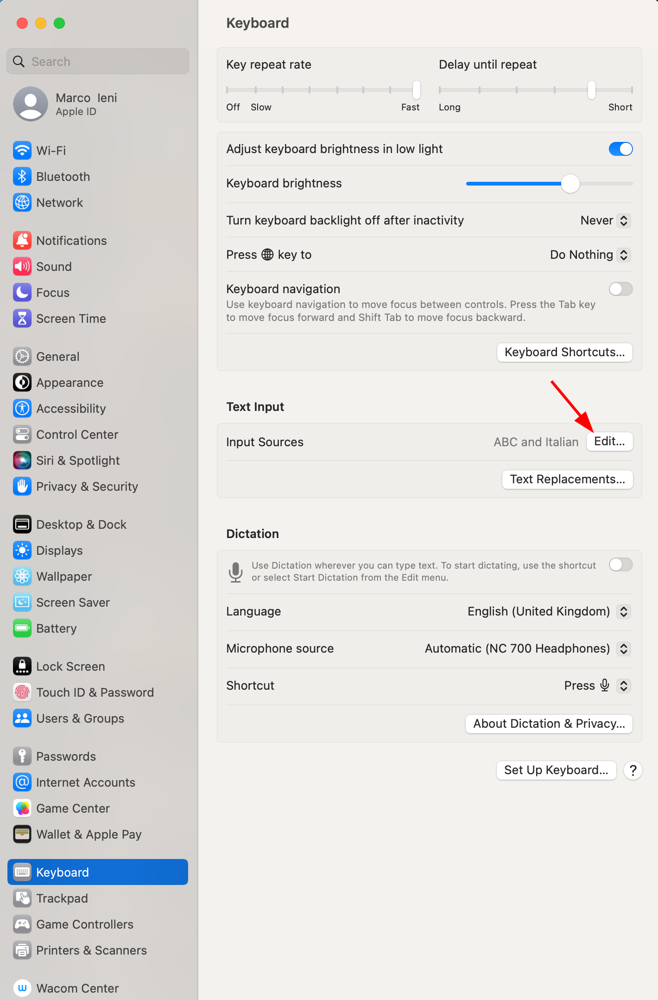
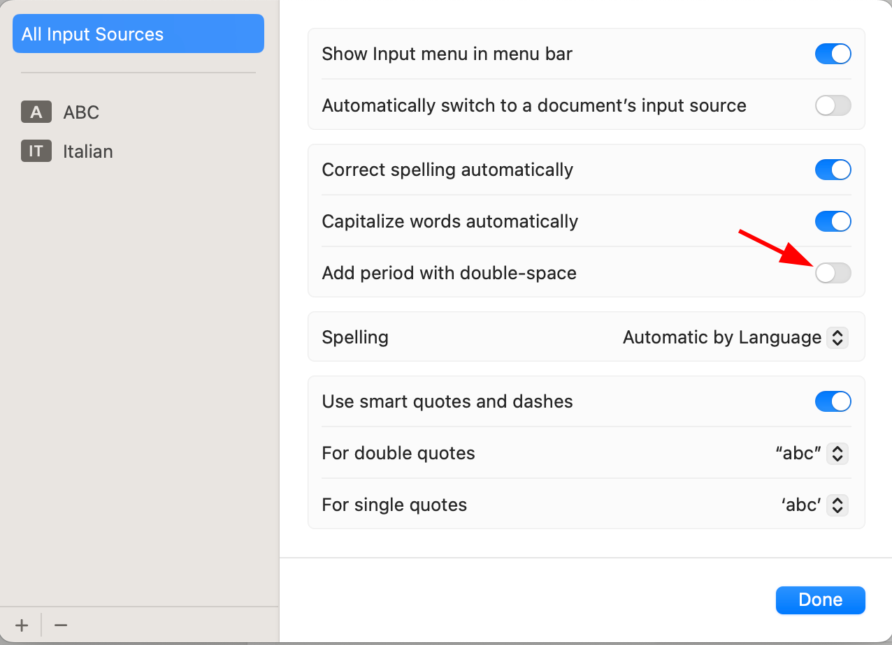

# Troubleshooting

## See Glimpse logs

1. Press `Ctrl+Shift+P` and select `Developer: Show Logs...`
2. Select `Glimpse`.

## SPC SPC doesn't work as expected on Mac OS

When pressing `SPC SPC` quickly on macOS, sometimes Glimpse doesn't recognize it.

This problem is due to a keyboard setting on macOS that adds a period with double space.

Open "System Settings" -> "Keyboard" -> "Input Sources" -> "Edit..."



Disable the "Add period with double-space" option.



If you don't use this feature, disabling it should fix this issue.
Otherwise, add `.` to open the glimpse menu in your [configuration](configuration#add-a-key-binding-to-the-top-menu):

```js
module.exports = function editConfig(menu) {
  menu.items.push({
    name: "Commands",
    key: ".",
    icon: "rocket",
    command: "workbench.action.showCommands",
  });

  return menu;
};
```

## Unresponsive menu activation

If you press `<spc>` on an editor and the glimpse menu doesn't appear immediately, you might have
one of the following problems.

### Conflicting vim binding

If in your `settings.json` file you have a vim binding that starts with `<spc>`, vim will wait for
the second input when `<spc>` is pressed. Example:

```json title="settings.json"
"vim.normalModeKeyBindingsNonRecursive": [
  {
    "before": [" ", "d"],
    "after": ["d", "d"]
  },
  {
    "before": ["<space>"],
    "commands": ["glimpse.menu"]
  }
]
```

In order to solve it, remove the conflicting Vim bindings from your `settings.json`.

### Virtual Machine or slow hardware

If you are working on limiting resources consider using [VSCode remote](https://code.visualstudio.com/docs/remote/remote-overview)

### Other conflicts

Try to remove all the extensions except glimpse, and clean your `settings.json`
and `keybindings.json` files to spot some weird conflicts.
